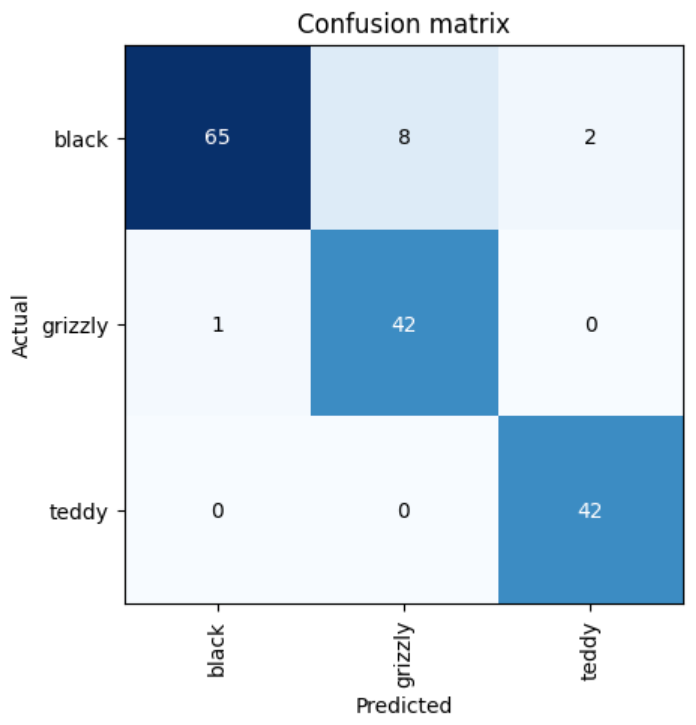

# black, grizzly or teddy bear
this notebook adds an extra dimension to the first notebook by an additional category. i modified the original fastai
notebook to continue to use DuckDuckGo as the Bing search method was more complicated and broken.
  
the initial code and method of data/labels was retained. the `DataBlock` is setup like this:
```python
bears = DataBlock(
    blocks=(ImageBlock, CategoryBlock), 
    get_items=get_image_files, 
    splitter=RandomSplitter(valid_pct=0.2, seed=42),
    get_y=parent_label,
    item_tfms=Resize(128))
```
  
the notebook demonstrates several types of resize methods, then finally uses `RandomResizedCrop` to provide some variation
in the images.
```python
bears = bears.new(
    item_tfms=RandomResizedCrop(224, min_scale=0.5),
    batch_tfms=aug_transforms(mult=2))
dls = bears.dataloaders(path)
```
  
the fine-tuning step remains the same, but we add `ClassificationInterpretation.learner(learn)` to provide a visual
look at errors in classification. this occurred because of the similar shape and color between the different types of 
bears. for example, from a training standpoint with the number of images we use, it might be difficult to distinguish 
between a black and brown bear in some of these images, or there might be a picture of both in a youtube video.

in the image you can see all the mistakes occurred between black and grizzly bears.
  
we can use an inline command to display some of the losses.
```python
interp.plot_top_losses(5, nrows=1)
```
  
fastai also has an inline data cleaner to correct inappropriate images:
```python
cleaner = ImageClassifierCleaner(learn)
cleaner
```
  
a visual window with dropdowns appear to allow you to re-label, remove and leave an image as is. when you select the
options, you run the below for each label selection. in this case, you run the below for black, grizzly and teddy bears
three times in total:
```python
for idx in cleaner.delete(): cleaner.fns[idx].unlink()
for idx,cat in cleaner.change(): shutil.move(str(cleaner.fns[idx]), path/cat)
```
  
we also export a `.pkl` file to save the model for later:
```python
learn.export()
```
  
then we demonstrate loading and using the file:
```python
learn_inf = load_learner(path/'export.pkl')
learn_inf.predict('grizzly.jpg')
```
  
The second part of this chapter deals with deploying to a more production-ready system, which is much more complex. In 
this example with bears, let's say we wanted to deploy a bear detection system for a national park's video camera system:
  * low resolution camera images, and dealing with video
  * handling it fast enough to be useful
  * the dataset we collected is from photos people took, but these are much more ideal than in real-life situations. we
might need to collect and label our own data to deal with more realistic situations.
  * nighttime images
  
These are just some examples of dealing with what is generally described as out-of-domain data. There might be data that 
is very different from what our model has seen during training.
  
Another common problem is domain shift, where the type of data that our model sees changes over time. For example, an
insurance company may use deep learning for its pricing and risk algorithm, but over time the types of customers that the
company attracts, and the types of risk they represent may change so much that the original training data is no longer
relevant. There is a strategy to mitigate some of these problems generally:
  
  * Manual Process
    * run model in parallel
    * humans check all predictions
  * Limited scope deployment
    * careful human supervision
    * time or geography limited
  * gradual expansion
    * good reporting systems needed
    * consider what could go wrong
  
Where possible, the first step is to use an entirely manual process, with the model running in parallel but not being
directly used to drive any actions. The humans should inspect the output from the model and check whether they make sense.
  
The second step is to try to limit the scope of the model, and still have it supervised by people.
  
Another challenge is that the model may change the behavior of the system that it is a part of (bias, feedback loops).
Ref. - [To Predict and Serve](https://rss.onlinelibrary.wiley.com/doi/full/10.1111/j.1740-9713.2016.00960.x)
 
From the book: "A helpful exercise prior to rolling out a significant machine learning system is to consider this question: "What would happen if it went really, really well?" In other words, what if the predictive power was extremely high, and its ability to influence behavior was extremely significant? In that case, who would be most impacted? What would the most extreme results potentially look like? How would you know what was really going on?"

Questionnaire:
1. Q: Provide an example of where the bear classification model might work poorly in production, due to structural or style differences in the training data.
  
A: staged photos, mis-labeling between brown and grizzlies (due to my own limited knowledge)
  
2. Q: Where do text models currently have a major deficiency? 
  
A: large amounts of data collected, maybe not enough quality control. for example programming q/a's on stack overflow might
not have been reviewed by an actual coder, or may not actually compile.
  
3. Q: What are possible negative societal implications of text generation models?
  
A: biases introduced by people preparing the data
  
4. Q: In situations where a model might make mistakes, and those mistakes could be harmful, what is a good alternative to automating a process?
  
A: human supervision
  
5. Q: What kind of tabular data is deep learning particularly good at?
 
A: can include the variety of columns you can include, for example columns container natural language: think book titles,
ISBN's, addresses, zip codes. this maybe an advantage over random forest and gradient boosting machines. from book:
"Because deep learning models are good at handling high-cardinality categorical variables, they are quite good at handling recommendation systems."
  
6: Q: What's a key downside of directly using a deep learning model for recommendation systems?
  
A: homogenous recommendations that never break someone out of their loop if they want to discover new music. may recommend
the same things over and over again, get bored. kids plays affect adults playlists or multiple people using same account.

7: Q: What are the steps of the Drivetrain Approach?
  
A:  
* consider the objective
* think about what actions you can take to meet that objective and what data you have (levers), then build a model that you can use to determine the best actions you can take to get the best results in terms of the objective.

8: Q: How do the steps of the Drivetrain Approach map to a recommendation system?
  
A:  
* the result you want is to drive users to the music they enjoy the most, and discover new music they haven't heard before
* collect data about user's listening preferences
  * what artists, albums, genres do the users listen to the longest
  * roll out a model that recommends similar genres, sub-genres or albums by known artists that haven't heard yet
  * collect play time from recommendations
  * aggregate similar preferences between users and follow trends in groups of users
  * longest plays get preferential weights
  * collect user satisfaction and aggregate with recommendations
  * tune model regularly to adjust for changes in tastes
  
9: Q: Create an image recognition model using data you curate, and deploy it on the web.
  
10: Q: What is DataLoaders?
  
A: an abstract class that iterates over a DataBlock and facilitates
  
11: Q: What four things do we need to tell fastai to create DataLoaders?
  
A: * data working with, how to get the list of items, how to label, how to create the validation set 
  
12: Q: What does the splitter parameter to DataBlock do?
  
A: siphon off a percentage of the data for validation
  
13: Q: How do we ensure a random split always gives the same validation set?
  
A: fix the random seed. if the seed stays the same, it will remain unchaged.
  
14: Q: What letters are often used to signify the independent and dependent variables?
  
A: independent = x, dependent = y. independent = thing we are making predictions from, dependent = target (in this case label)

15: Q: What's the difference between the crop, pad, and squish resize approaches? When might you choose one over the others?
  
A: crop chops part of the image off, pad fixes the image size but might have black bars if image same ratio, squish will change 
the appearance making things skinny to fit the pix size. could use crop to have more variety in positional placement
  
16: Q: What is data augmentation? Why is it needed?
  
A: creating random variations in the data to make your training set more robust. flipping, warping, changing contrast/brightness. 
creating changes that don't change the underlying meaning of your data.
  
17. Q: What is the difference between item_tfms and batch_tfms?
  
A: item_tfms happen in the DataBlock and allow you to apply parameters such as resize to 128 pix, batch_tfms apply to things at the batch level such
as a global multiplier.
  
18. Q: What is a confusion matrix?
 
A: allows you to visually see the distribution of results from fine-tuning and errors where label and prediction skewed
  
19. Q: What does export save?
  
A: export pkl file for use/loading later
  
20. Q: What is it called when we use a model for getting predictions, instead of training?
  
A: inference
  
21. Q: What are IPython widgets?
  
A: allow you to embed jupyter notebook elements for use in website
  
22. Q: When might you want to use CPU for deployment? When might GPU be better?
 
A: cpu deployment will be slower, but on intel x86 can have enormous amount of RAM. gpu faster, but much more expensive 
and cant add RAM later.
  
23. Q: What are the downsides of deploying your app to a server, instead of to a client (or edge) device such as a phone or PC?
  
A: use server compute resources, could use edge device to do smaller, local compute if possible and crowd source the inference.
  
24. Q: What are three examples of problems that could occur when rolling out a bear warning system in practice?
  
A: too slow, real-world data doesnt match training data, train on images, but now have to deal with video
  
25. Q: What is "out-of-domain data"?
 
A: data outside the original domain (training). for example, original data could lack real-world context when deployed
  
26. Q: What is "domain shift"?
  
A: recommendation systems might cease to work as well as user preferences and habits change over time. also, bias can enter
the feedback loop of improvement and change the desired outcomes.
  
27. Q: What are the three steps in the deployment process?
  
A: 
  * first start with a passive model, humans doing task and reviewing model output
  * do a limited-scope deployment where the scope is a very small subset to start with. careful human supervision. for example
with bears, limit the time or geography
  * gradual expansion - develop good reporting, metrics and/or tests. consider what could go wrong in the future. consider
what would happen if it went really well.


